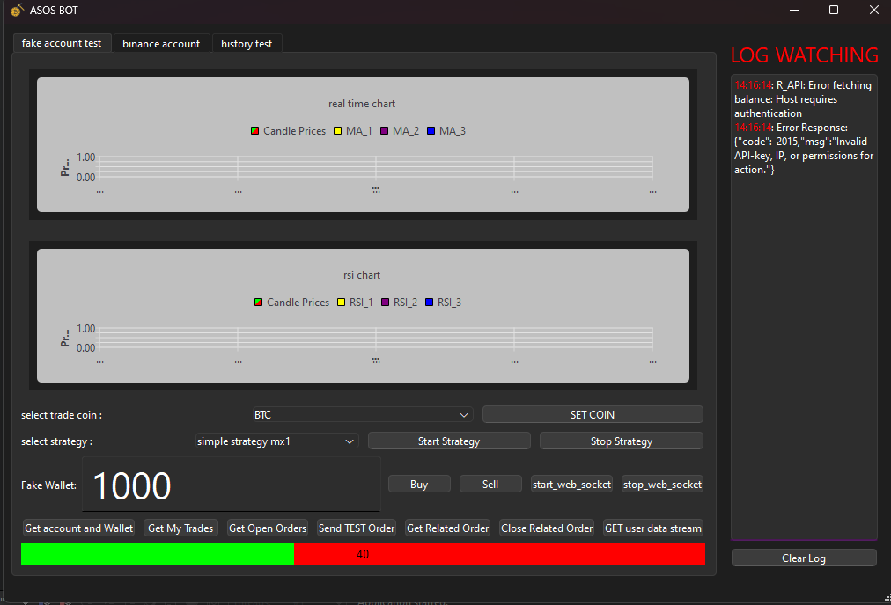
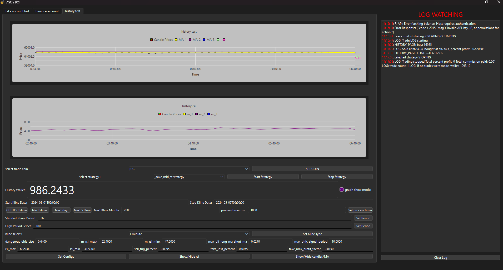
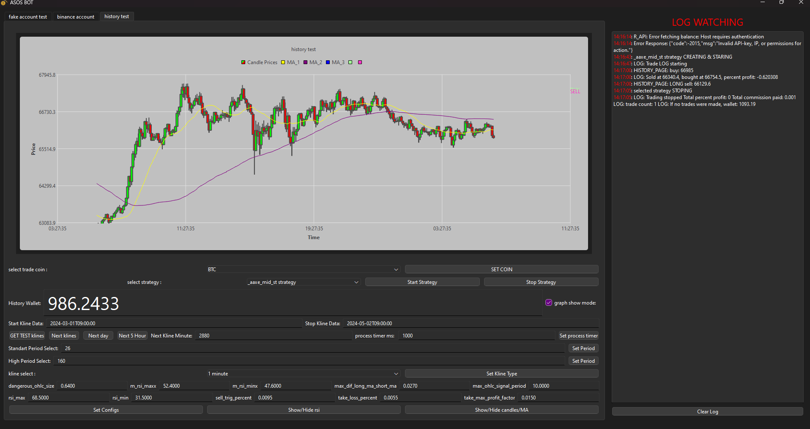
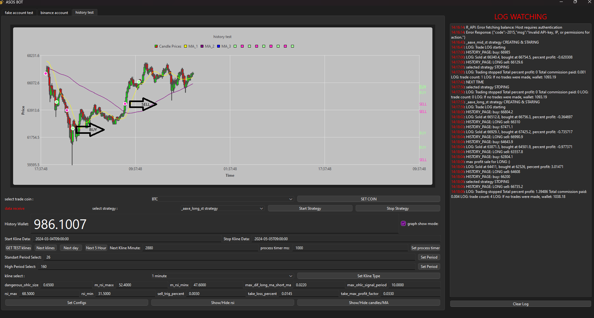

# Trader_Bot

### **Author:**  
**Ali Şahbaz**  
📧 **Email:** ali_sahbaz@outlook.com  

---

## **Description**  
**Trader_Bot** is a high-performance trade bot built with **C++ and Qt Framework 6.7.1**, specifically designed for cryptocurrency markets.  
This bot leverages advanced algorithms, multithreading, and real-time data analysis to execute trades based on user-defined strategies. With its customizable parameters and robust risk management tools, it serves as a powerful tool for both backtesting and live trading.

---

## **Required Expertise & Keywords**  
This project requires expertise in the following areas:  
- **Quant Developer**: Building high-performance algorithms for financial markets.  
- **HFT Algorithms**: High-frequency trading strategies and systems.  
- **C++**: Proficiency in C++ for developing performance-critical applications.  
- **Mathematics**: Advanced mathematical models for financial data analysis and algorithmic trading.  
- **Finance**: Understanding of financial markets, trading strategies, and risk management.  
- **Cryptocurrency Markets**: Knowledge of cryptocurrency trading platforms and APIs.  
- **Multithreading**: Efficient execution of concurrent tasks in high-performance applications.  
- **Technical Analysis**: Use of indicators like Moving Averages, MACD, Bollinger Bands, etc.  
- **Backtesting**: Designing and running tests for trading strategies using historical data.

**Keywords:**  
Quantitative Finance, Algorithmic Trading, High-Frequency Trading (HFT), C++, Mathematical Models, Cryptocurrency, Real-Time Data, Trading Strategies, Backtesting, Risk Management, Trading Bots, Finance, Technical Analysis.


---

## **Features**
### **Core Functionalities**
- **Custom Graphics Processing:** High-performance visualization tools for monitoring and analysis.  
- **Trade / HFT Algorithm Integration:** Implements cutting-edge algorithms for high-frequency trading.  
- **Modern Software Patterns:** Employs advanced design patterns for maintainable and scalable development.  
- **Simplified Strategy Management:** Easily add and test new trading strategies with minimal effort.  
- **Custom Binance WebSocket Library:** Built for efficient real-time data retrieval and communication.  
- **Custom Binance REST API Implementation:** Provides seamless interaction with Binance endpoints.  
- **Real-Time Testing:** Direct testing of strategies with live market data.  
- **Backtesting Support:** Analyze historical data to optimize and validate strategies.  
- **Fake Account Testing:** Test strategies without risking actual funds.  
- **Custom OHLC Structures & Math Models:** Supports complex calculations and high-precision operations.  
- **20+ Pre-Built Strategies:** Includes templates (`template_strategy.h`) for creating your own strategies.  
- **Comprehensive Logging Support:** Provides detailed logs for debugging, analysis, and auditing.  
- **User-Friendly GUI:** Offers an intuitive interface for traders to easily manage and monitor their trading activities.

---

## **Screenshots**  

### **1. Binance Fake Account & Realtime Monitoring**  
  
This page emulates a Binance account. It supports:  
- Monitoring real-time coin data  
- Placing buy/sell orders  
- Integrating strategies  
- Viewing open orders, wallet balance, and logs  

### **2. History Testing Page**  
  
Provides an interface to visualize and analyze **RSI** and real-time data graphics. Features include:  
- Configurable visibility of data elements  
- Adjustable display settings  

### **3. Strategy Testing & Backtesting**  
  
Allows users to:  
- Select a strategy and a time range for backtesting  
- Start testing and monitor data flow  
- Control data flow speed via the GUI  
- Log activities and set custom parameters for strategies  
- Select coins and specify candle types, supporting up to second-level granularity  

### **4. Visual Trade Analysis**  
  
Displays **LONG** and **SHORT** orders directly on the graph. Features include:  
- Analyzing past wallet performance  
- Evaluating the strength of strategies through logs and graphical representations  

---


## **Core Concepts & Indicators**

### **1. Moving Average (MA)**  
The **Moving Average (MA)** calculates the average price movement of an asset over time. It helps traders smooth out price data and identify trends.  

#### **Types of Moving Averages:**

- **Simple Moving Average (SMA):**  
  The arithmetic average of prices over a specific time period.  
  Example: A 50-day SMA would average the closing prices of an asset over the past 50 days.

- **Exponential Moving Average (EMA):**  
  EMA gives more weight to recent prices, making it more sensitive and faster to respond to price changes.  
  Example: The 12-period EMA gives more importance to the last 12 price points than to the earlier ones.

**Application in Trading:**  
Moving Averages can act as support and resistance levels. When the price is above a moving average, it may be seen as a support level, while if the price is below, it can be seen as a resistance level.  

#### **Crossover Strategies:**
- **Golden Cross:** When a short-term moving average crosses above a long-term moving average, it's a potential **buy signal**.  
  Example: A 50-day SMA crossing above a 200-day SMA.
  
- **Death Cross:** When a short-term moving average crosses below a long-term moving average, it’s a potential **sell signal**.  
  Example: A 50-day SMA crossing below a 200-day SMA.

---

### **2. MACD (Moving Average Convergence Divergence)**  
MACD is a momentum and trend-following indicator that shows the relationship between two moving averages of an asset's price.  
- The MACD line is calculated by subtracting the 26-period EMA from the 12-period EMA.  
- The signal line is the 9-period EMA of the MACD line.

**Trading Signals:**  
- **Bullish signal:** When the MACD crosses above the signal line.  
- **Bearish signal:** When the MACD crosses below the signal line.

---

### **3. Bollinger Bands**  
Bollinger Bands are volatility indicators that consist of a middle band (SMA) and two outer bands that are standard deviations away from the middle band.  
- **Upper Band:** Represents overbought conditions.  
- **Lower Band:** Represents oversold conditions.

**Usage in Trading:**  
- Price bouncing off the lower band may indicate a **buy** signal, and bouncing off the upper band may indicate a **sell** signal.

---

### **4. Fibonacci Retracement**  
Fibonacci retracement is a tool used to identify potential levels of support and resistance. The key Fibonacci levels are **23.6%, 38.2%, 50%, 61.8%**, and **100%**.

**Example:**  
- If the price rises from 100 to 200, traders may expect the price to retrace to levels such as 161.8% of the rise (161.8% of 100-200 move) before continuing the uptrend.

---

### **5. Stochastic Oscillator**  
The Stochastic Oscillator measures the level of the closing price relative to the high-low range over a specific period.  
- **Overbought zone:** Values above 80 indicate overbought conditions.  
- **Oversold zone:** Values below 20 indicate oversold conditions.

**Usage in Trading:**  
- A **buy signal** occurs when the oscillator crosses from below 20 to above 20.  
- A **sell signal** occurs when it crosses from above 80 to below 80.

---

### **6. Divergence**  
Divergence occurs when the price of an asset moves in the opposite direction of an indicator (such as MACD or RSI), potentially signaling a reversal.  

**Example:**  
- **Bullish Divergence:** When prices form lower lows, but the indicator forms higher lows, suggesting potential upward momentum.  
- **Bearish Divergence:** When prices form higher highs, but the indicator forms lower highs, suggesting potential downward momentum.

---

### **7. Parabolic SAR (Stop and Reverse)**  
The Parabolic SAR is a trend-following indicator that helps determine the potential reversal points in the market.  
- When the SAR is below the price, the trend is bullish, and when it is above the price, the trend is bearish.

---

### **8. Ichimoku Kinko Hyo**  
This is a Japanese technical analysis indicator that provides insights into the market’s trend, support and resistance levels, and potential future price movements. It consists of five lines:  
- **Tenkan-sen:** A fast-moving average.  
- **Kijun-sen:** A slower-moving average.  
- **Senkou Span A and B:** Leading lines forming the cloud, which indicates support or resistance.  
- **Chikou Span:** The lagging line, showing the current price in relation to the past.

---

### **9. ATR (Average True Range)**  
The ATR measures volatility by calculating the average of true ranges (the difference between the high and low of an asset for a period). A higher ATR indicates higher volatility.

---

### **10. Chaikin Money Flow (CMF)**  
CMF is a volume-weighted average of accumulation and distribution over a specified period. It measures the money flow of an asset.  

**Interpretation:**  
- **Positive CMF:** Indicates accumulation (buying pressure).  
- **Negative CMF:** Indicates distribution (selling pressure).

---

### **11. On-Balance Volume (OBV)**  
OBV is a cumulative indicator that adds volume on up days and subtracts volume on down days, helping to gauge the direction of the trend.

---

### **12. Williams %R**  
Williams %R is a momentum indicator that measures overbought and oversold conditions.  
- **Overbought:** Values above -20.  
- **Oversold:** Values below -80.

---

### **13. Economic Indicators**  

- **CPI (Consumer Price Index):** Measures the average change over time in the prices paid by consumers for goods and services.  
- **PPI (Producer Price Index):** Measures the average change in selling prices received by domestic producers for their output.  
- **GDP (Gross Domestic Product):** Represents the total value of goods and services produced by a country in a specific time period.  

---

### **14. Option Greeks**

- **BETA:** Measures an asset’s sensitivity to market movements.  
- **Delta:** Measures the rate of change of an option’s price relative to the underlying asset’s price.  
- **Gamma:** Measures the rate of change in delta.  
- **Vega:** Measures an option's sensitivity to volatility.  
- **Theta:** Measures the time decay of options.  
- **Rho:** Measures an option's sensitivity to interest rate changes.

---

### **15. Trading Concepts**  
- **Spread:** The difference between an asset’s buying price and selling price.  
- **Margin:** The amount of capital required to open a position.  
- **Leverage:** Allows you to control a larger position with a smaller amount of capital.  
- **Drawdown:** The decline from the highest value to the lowest during a particular period.  

---

## **How to Use**  

1. Clone the repository:  
   ```bash
   git clone https://github.com/Alishbz/Trader_Bot.git
   cd Trader_Bot
